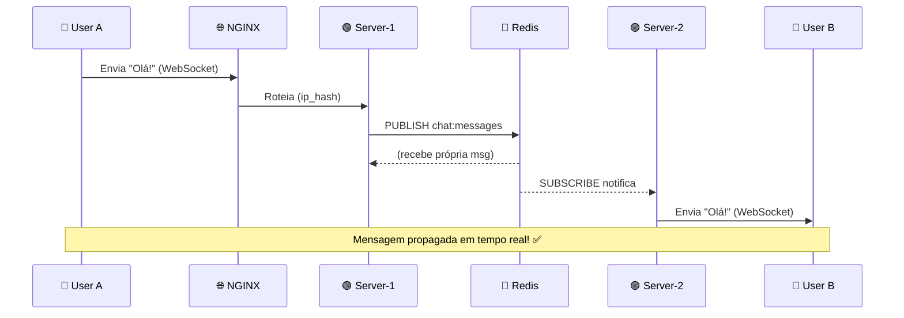
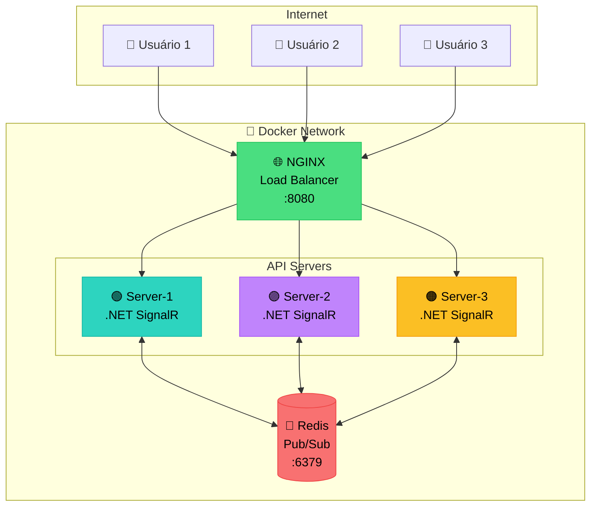

# 🚀 Escala Horizontal com WebSockets

## O Problema

Imagine que você tem um chat funcionando em **um servidor**. Tudo funciona bem.

Mas e quando você precisa de **mais servidores** para aguentar mais usuários?

```
Usuário A conecta no Server-1
Usuário B conecta no Server-2

A envia mensagem... B não recebe! 😱
```

**Por quê?** Porque cada servidor só conhece seus próprios clientes.

---

## A Solução: Redis como "Ponte"

O Redis funciona como um **mensageiro central** entre os servidores.

1. **Server-1** recebe mensagem do Usuário A
2. **Server-1** publica no Redis
3. **Redis** avisa todos os servidores
4. **Server-2** recebe e envia pro Usuário B

Agora todos recebem todas as mensagens! ✅

---

## Como Rodar

```bash
docker-compose up --build
```

Acesse: **http://localhost:8080**

---

## Arquitetura

### 📐 Documentação C4 Model

| Diagrama | Descrição |
|----------|-----------|
| [**C1 - Contexto**](docs/c4/README.md) | Visão geral do sistema |
| [**C2 - Container**](docs/c4/README.md) | Aplicações e data stores |
| [**C3 - Componentes**](docs/c4/README.md) | Estrutura interna da API (modo PubSub) |

👉 **[Ver diagramas C4 completos](docs/c4/README.md)**

---

### Fluxo de Mensagem



---

### Visão Geral da Infraestrutura



---

## O Que Está Rodando

| Container | Tipo | Função |
|-----------|------|--------|
| **nginx** | Load Balancer | Serve frontend + distribui conexões |
| **server-1** | API | Instância 1 do SignalR |
| **server-2** | API | Instância 2 do SignalR |
| **server-3** | API | Instância 3 do SignalR |
| **redis** | Message Broker | Pub/Sub entre instâncias |

---

## Teste Você Mesmo

1. Abra **3 abas** do navegador em http://localhost:8080
2. Veja que cada aba pode conectar em um **servidor diferente**
3. Envie uma mensagem em qualquer aba
4. **Todas as abas recebem!** 🎉

---

## Dois Modos de Implementação

O modo é configurado via variável de ambiente `Redis__Mode` no `docker-compose.yml`.

### 🪄 Automático (`Redis__Mode: SignalR`)
O SignalR faz tudo sozinho. Você só adiciona uma linha de configuração.

### 🔧 Manual (`Redis__Mode: PubSub`)
Implementação explícita do Pub/Sub. Mostra exatamente o que acontece por baixo dos panos.